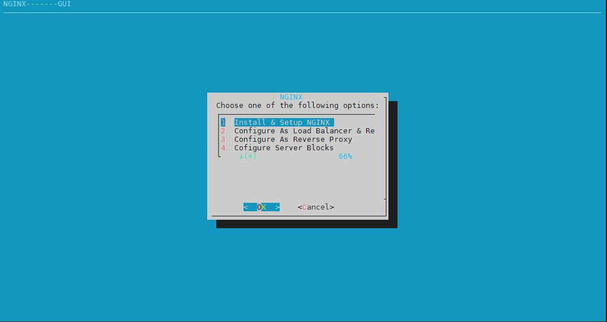
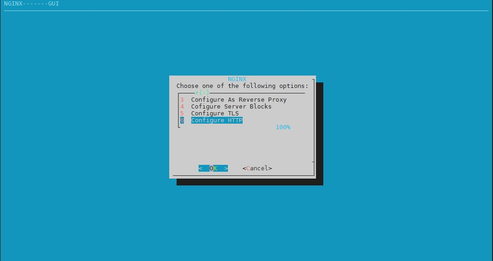

##### Steps.

```
bash NGINX.sh
```
##### Options.

```
1- Install Nginx
2- Configure Load Balancer And Reverse Proxy
3- Configure Reverse Proxy
4- Configure Server Blocks (Virtual Hosts)
5- Configure HTTPS Connection
6- Select Your index.html file (Default HTML Page For The Site )
```



